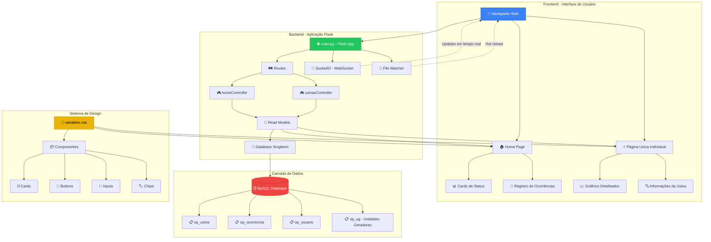
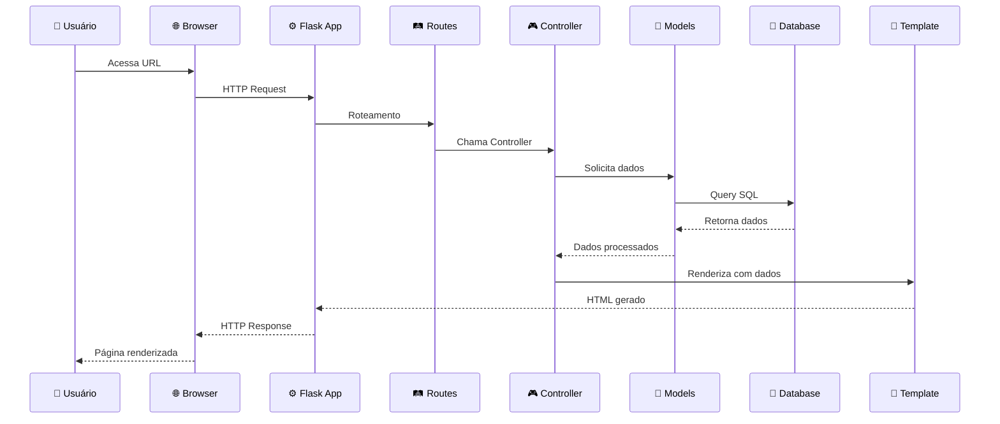
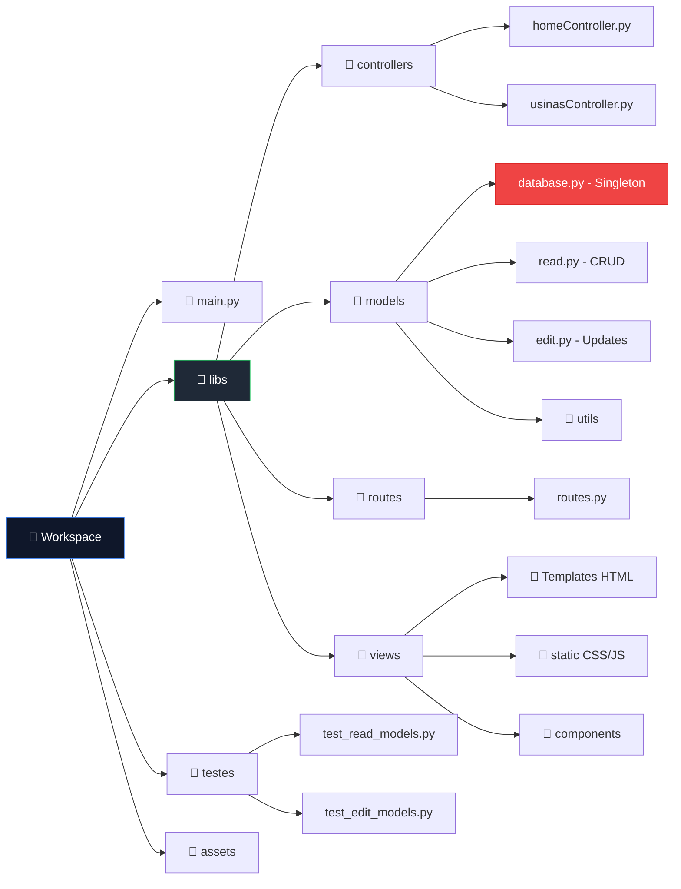
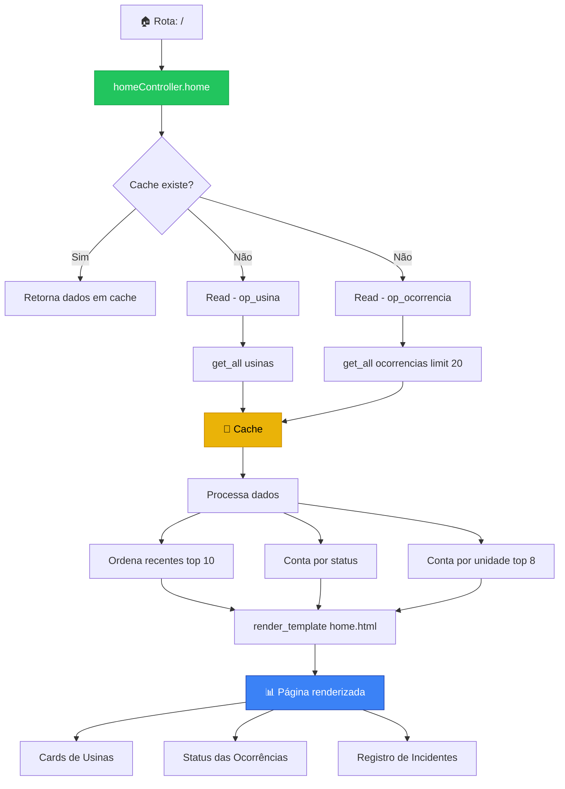
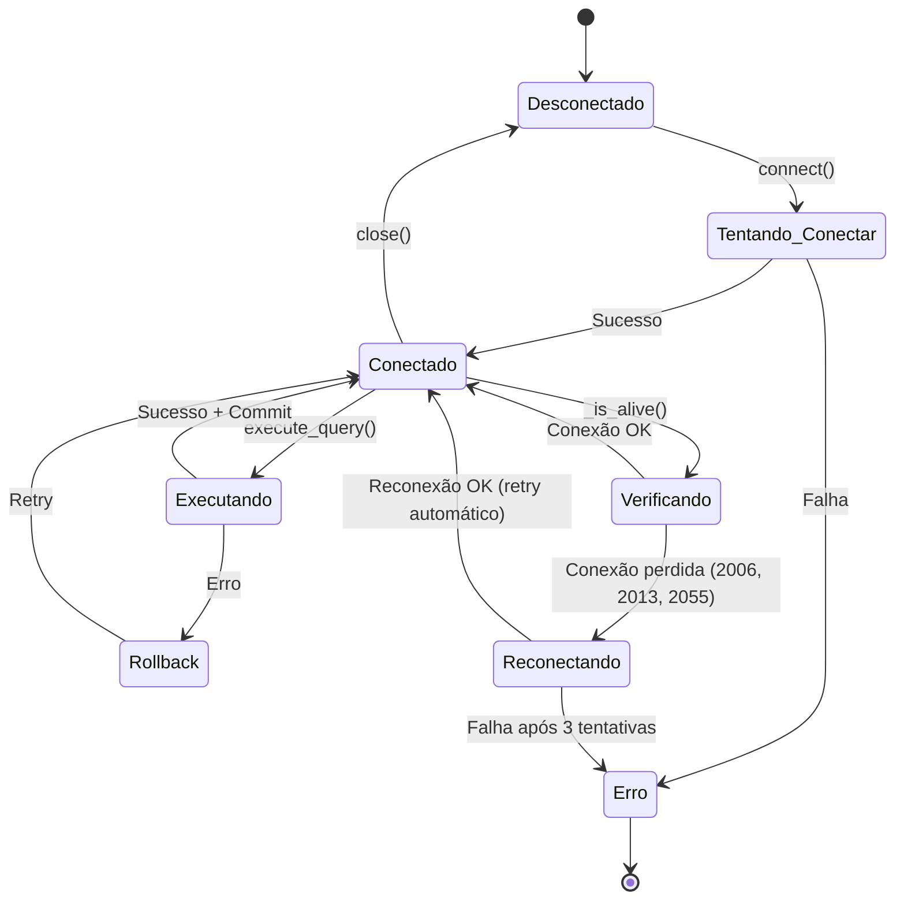
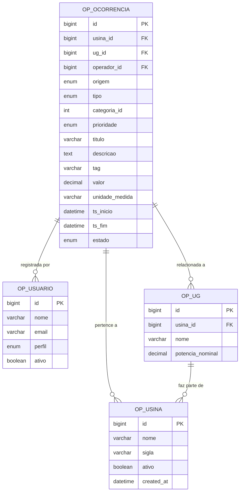
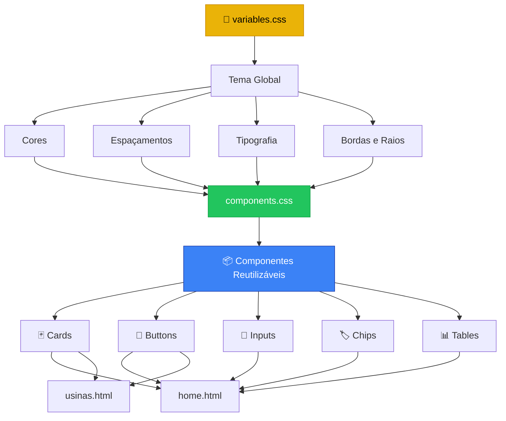
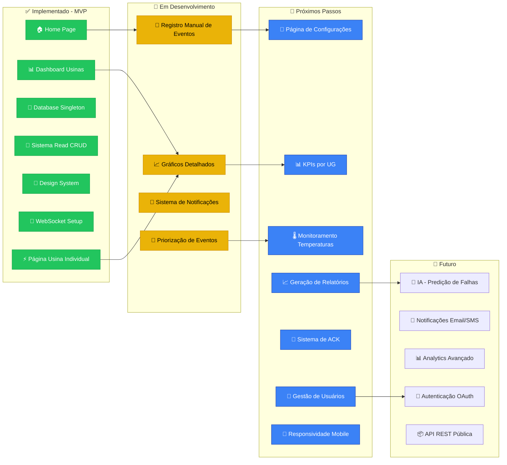
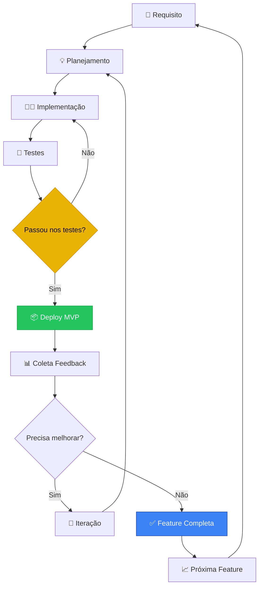
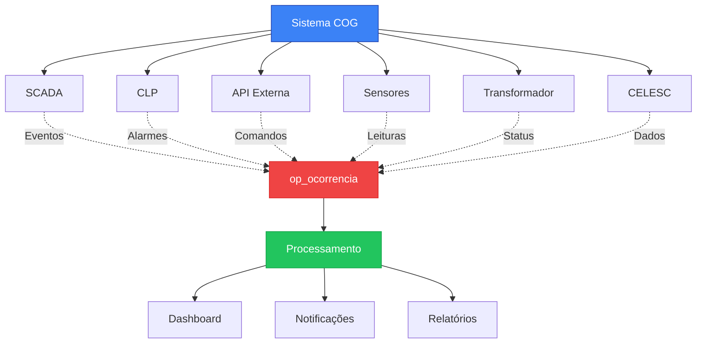

# 🔄 Fluxograma do Projeto - Sistema COG (Monitoramento de Usinas)

## 📊 Visão Geral da Arquitetura

## 🔄 Fluxo de Requisição HTTP

## 📁 Estrutura do Projeto

## 🎯 Fluxo de Dados - Home Page

## 🔌 Sistema de Conexão com Banco de Dados

## 📋 Modelo de Dados - Ocorrências

## 🎨 Sistema de Componentes UI

## 🚀 Status Atual e Roadmap

## 🔄 Ciclo de Desenvolvimento

## 📊 Principais Integrações

---

## 📌 Legenda

- 🏠 **Home**: Página principal com visão geral
- ⚡ **Usina**: Página detalhada por usina
- 📊 **Dashboard**: Visualização de métricas
- 🚨 **Ocorrências**: Sistema de eventos e alarmes
- 💾 **Database**: Camada de dados
- 🎨 **Design System**: Sistema de componentes UI
- 🔌 **WebSocket**: Comunicação em tempo real
- ✅ **Implementado**: Features completas
- 🚧 **Em Desenvolvimento**: Work in progress
- 📅 **Próximos Passos**: Backlog priorizado
- 🎯 **Futuro**: Roadmap de longo prazo

---

## 🎯 Propósito do Sistema

**Reduzir paradas e custo operacional em CGHs/PCHs** transformando sinais e registros em:
- ✅ Ações padronizadas
- 🔔 Notificações úteis
- 📊 Relatórios automáticos

**Objetivo**: Menos paradas, mais energia faturada e relatórios automáticos — com uma rotina tão simples que o operador quer usar.

