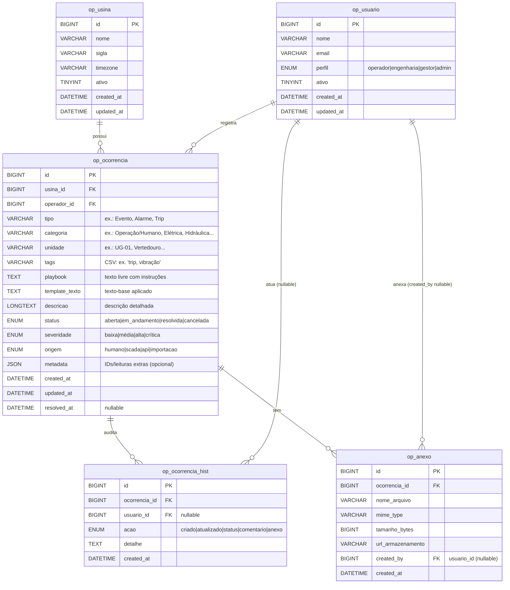

## Banco de dados

## read.py
### Classe base: Read

Pensada para SELECTs genéricos parametrizados, com reuso da conexão.

#### `get_all(limit=None, offset=None, order_by=None, desc=None) -> List[Dict]`

**Descrição:** Busca todos os registros da tabela com opções de paginação e ordenação.

**Query SQL:** `SELECT ... FROM tabela [ORDER BY coluna [ASC|DESC]] [LIMIT limite OFFSET deslocamento]`

**Parâmetros:**
- `limit: int | None` – Número máximo de linhas a retornar
- `offset: int | None` – Número de linhas a pular (para paginação)
- `order_by: str | None` – Nome da coluna para ordenação
- `desc: bool | None` – Se True, ordena em ordem decrescente (padrão definido em `default_desc` da classe)

**Retorno:** Lista de dicionários, onde cada dicionário representa uma linha da tabela.

**Exemplo:**
```python
# Buscar primeiros 10 usuários ordenados por nome
usuarios = OpUsuario().get_all(limit=10, order_by="nome")

# Buscar próximos 10 usuários (página 2)
usuarios_p2 = OpUsuario().get_all(limit=10, offset=10, order_by="nome")
```

---

#### `get_by_id(id_: int) -> Optional[Dict]`

**Descrição:** Busca um registro específico pelo seu ID.

**Query SQL:** `SELECT ... FROM tabela WHERE id = %s LIMIT 1`

**Parâmetros:**
- `id_: int` – ID do registro a ser buscado

**Retorno:** Dicionário com os dados do registro ou `None` se não encontrado.

**Exemplo:**
```python
# Buscar usuário com ID 123
usuario = OpUsuario().get_by_id(123)
if usuario:
    print(f"Nome: {usuario['nome']}")
```

---

#### `first(where: dict | None = None, order_by=None, desc=None) -> Optional[Dict]`

**Descrição:** Retorna o primeiro registro que atende aos critérios especificados.

**Query SQL:** Equivale a chamar `where(..., limit=1)` e retornar o primeiro resultado.

**Parâmetros:**
- `where: dict | None` – Critérios de filtro (mesma sintaxe do método `where`)
- `order_by: str | None` – Coluna para ordenação
- `desc: bool | None` – Ordem decrescente se True

**Retorno:** Dicionário com a primeira linha encontrada ou `None`.

**Exemplo:**
```python
# Primeiro usuário ativo ordenado por data de criação
primeiro_ativo = OpUsuario().first(
    where={"ativo": True}, 
    order_by="created_at"
)
```

---

#### `count(where: dict | None = None) -> int`

**Descrição:** Conta o número de registros que atendem aos critérios.

**Query SQL:** `SELECT COUNT(*) AS total FROM tabela [WHERE ...]`

**Parâmetros:**
- `where: dict | None` – Critérios de filtro (ver operadores abaixo)

**Retorno:** Número total de registros (int).

**Exemplo:**
```python
# Contar usuários ativos
total_ativos = OpUsuario().count(where={"ativo": True})

# Contar todas as ocorrências
total_ocorrencias = OpOcorrencia().count()
```

---

#### `where(where: dict, limit=None, offset=None, order_by=None, desc=None, columns=None) -> List[Dict]`

**Descrição:** Busca registros com critérios de filtro customizados.

**Query SQL:** `SELECT [colunas] FROM tabela WHERE [condições] [ORDER BY] [LIMIT/OFFSET]`

**Parâmetros:**
- `where: dict` – Critérios de filtro (obrigatório, ver operadores abaixo)
- `columns: '*' | list[str] | None` – Colunas específicas a retornar (padrão: todas as colunas do modelo)
- `limit/offset/order_by/desc` – Mesmos parâmetros do `get_all`

**Retorno:** Lista de dicionários com os registros encontrados.

**Exemplo:**
```python
# Buscar usuários ativos com nome começando com "João"
usuarios = OpUsuario().where(
    where={
        "ativo": True,
        "nome": ("startswith_norm", "João")
    },
    order_by="nome",
    limit=50
)

# Buscar apenas ID e nome dos usuários
usuarios_simples = OpUsuario().where(
    where={"ativo": True},
    columns=["id", "nome"]
)
```

---

### Operadores aceitos no where (via build_where_clause)

| Operador | Sintaxe | Descrição | Exemplo |
|----------|---------|-----------|---------|
| **Igual** | `{"col": valor}` | Comparação de igualdade | `{"status": "ativo"}` |
| **IN** | `{"col": ("in", [valores])}` | Valor está na lista | `{"id": ("in", [1,2,3])}` |
| **LIKE** | `{"col": ("like", "padrão")}` | Busca com wildcards | `{"nome": ("like", "%João%")}` |
| **Diferente** | `{"col": ("ne", valor)}` | Não igual | `{"status": ("ne", "inativo")}` |
| **Maior que** | `{"col": ("gt", valor)}` | Maior que | `{"idade": ("gt", 18)}` |
| **Maior ou igual** | `{"col": ("gte", valor)}` | Maior ou igual | `{"preco": ("gte", 100)}` |
| **Menor que** | `{"col": ("lt", valor)}` | Menor que | `{"estoque": ("lt", 10)}` |
| **Menor ou igual** | `{"col": ("lte", valor)}` | Menor ou igual | `{"desconto": ("lte", 50)}` |
| **Regex** | `{"col": ("regexp", "padrão")}` | Expressão regular | `{"codigo": ("regexp", "^[A-Z]{3}")}` |

#### Operadores Normalizados
Estes operadores ignoram acentos, hífens, espaços e diferenças de maiúscula/minúscula:

| Operador | Sintaxe | Descrição |
|----------|---------|-----------|
| **LIKE normalizado** | `{"col": ("like_norm", "padrão")}` | LIKE ignorando acentos/caixa |
| **Igual normalizado** | `{"col": ("eq_norm", "texto")}` | Igualdade normalizada |
| **Começa com normalizado** | `{"col": ("startswith_norm", "texto")}` | Texto começa com (normalizado) |
| **Termina com normalizado** | `{"col": ("endswith_norm", "texto")}` | Texto termina com (normalizado) |

**Observação:** Os operadores `_norm` não alteram os dados salvos no banco; apenas normalizam durante a comparação.

---

#### `get_between(column="created_at", start=None, end=None, limit=None, offset=None, order_by=None, desc=None) -> List[Dict]`

**Descrição:** Busca registros em um intervalo de valores (principalmente datas).

**Query SQL:** `SELECT ... FROM tabela WHERE coluna BETWEEN inicio AND fim [ORDER BY] [LIMIT/OFFSET]`

**Parâmetros:**
- `column: str` – Nome da coluna para o filtro de intervalo (padrão: "created_at")
- `start: datetime | None` – Valor inicial do intervalo
- `end: datetime | None` – Valor final do intervalo
- `limit/offset/order_by/desc` – Mesmos parâmetros do `get_all`

**Retorno:** Lista de dicionários com os registros no intervalo.

**Exemplo:**
```python
from datetime import datetime, timedelta

# Ocorrências dos últimos 7 dias
data_inicio = datetime.now() - timedelta(days=7)
data_fim = datetime.now()

ocorrencias_recentes = OpOcorrencia().get_between(
    column="data_ocorrencia",
    start=data_inicio,
    end=data_fim,
    order_by="data_ocorrencia",
    desc=True
)
```

---

#### `ids_only(where: dict | None = None, limit: int | None = None) -> List[int]`

**Descrição:** Retorna apenas os IDs dos registros que atendem aos critérios.

**Query SQL:** `SELECT id FROM tabela [WHERE ...] [LIMIT ...]`

**Parâmetros:**
- `where: dict | None` – Critérios de filtro
- `limit: int | None` – Número máximo de IDs a retornar

**Retorno:** Lista de IDs (int).

**Exemplo:**
```python
# IDs de usuários ativos
ids_ativos = OpUsuario().ids_only(where={"ativo": True})

# Primeiros 100 IDs de ocorrências
ids_ocorrencias = OpOcorrencia().ids_only(limit=100)
```

---

### Models especializados

#### `OpUsina(Read)` 
- **Tabela:** `op_usina`
- **Ordenação padrão:** por `nome`

#### `OpUsuario(Read)`
- **Tabela:** `op_usuario` 
- **Ordenação padrão:** por `nome`

## edit.py
### Classe base: Edit

Para UPDATEs genéricos, com proteção de identificadores e where parametrizado.

#### `update_by_id(id_: int, data: Dict[str, Any]) -> int`

**Descrição:** Atualiza um registro específico pelo seu ID.

**Query SQL:** `UPDATE tabela SET coluna1=%s, coluna2=%s, ... WHERE id=%s`

**Parâmetros:**
- `id_: int` – ID do registro a ser atualizado
- `data: Dict[str, Any]` – Dicionário com as colunas e valores a serem atualizados (não pode ser vazio)

**Retorno:** Número de linhas afetadas (int). Retorna 0 se o ID não for encontrado.

**Exemplo:**
```python
# Atualizar nome e status de um usuário
linhas_afetadas = OpUsuarioEdit().update_by_id(
    id_=123,
    data={
        "nome": "João Silva",
        "ativo": True,
        "updated_at": datetime.now()
    }
)

if linhas_afetadas > 0:
    print("Usuário atualizado com sucesso")
else:
    print("Usuário não encontrado")
```

---

#### `update_where(where: Dict[str, Any], data: Dict[str, Any]) -> int`

**Descrição:** Atualiza múltiplos registros que atendem aos critérios especificados.

**Query SQL:** `UPDATE tabela SET coluna1=%s, coluna2=%s, ... WHERE [condições]`

**Usa os mesmos operadores de filtro do `Read.where`**

**Parâmetros:**
- `where: Dict[str, Any]` – Critérios de filtro (não pode ser vazio)
- `data: Dict[str, Any]` – Dicionário com as colunas e valores a serem atualizados (não pode ser vazio)

**Retorno:** Número de linhas afetadas (int).

**Exemplo:**
```python
# Desativar todos os usuários inativos há mais de 30 dias
from datetime import datetime, timedelta

data_limite = datetime.now() - timedelta(days=30)
linhas_afetadas = OpUsuarioEdit().update_where(
    where={
        "ativo": True,
        "last_login": ("lt", data_limite)
    },
    data={
        "ativo": False,
        "motivo_inativacao": "Inatividade prolongada",
        "updated_at": datetime.now()
    }
)

print(f"{linhas_afetadas} usuários foram desativados")
```

---

#### `increment(where: Dict[str, Any], field: str, step: int = 1) -> int`

**Descrição:** Incrementa (ou decrementa) o valor de uma coluna numérica.

**Query SQL:** `UPDATE tabela SET campo = campo + step WHERE [condições]`

**Parâmetros:**
- `where: Dict[str, Any]` – Critérios de filtro (não pode ser vazio)
- `field: str` – Nome da coluna numérica a ser incrementada
- `step: int` – Valor a ser somado (padrão: 1, use negativo para decrementar)

**Retorno:** Número de linhas afetadas (int).

**Exemplo:**
```python
# Incrementar contador de tentativas de login
tentativas_atualizadas = OpUsuarioEdit().increment(
    where={"email": "usuario@exemplo.com"},
    field="tentativas_login",
    step=1
)

# Decrementar estoque de um produto
estoque_atualizado = OpProdutoEdit().increment(
    where={"codigo": "PROD123"},
    field="quantidade_estoque",
    step=-5  # Remove 5 unidades
)
```

---

#### `set_json_key(where: Dict[str, Any], json_col: str, key: str, value: Any) -> int`

**Descrição:** Define ou atualiza uma chave específica dentro de uma coluna JSON.

**Query SQL:** `UPDATE tabela SET json_col = JSON_SET(COALESCE(json_col, JSON_OBJECT()), '$.key', CAST(%s AS JSON)) WHERE [condições]`

**Parâmetros:**
- `where: Dict[str, Any]` – Critérios de filtro (não pode ser vazio)
- `json_col: str` – Nome da coluna JSON (ex.: "metadata", "configuracoes")
- `key: str` – Chave JSON a ser definida (apenas caracteres [A-Za-z0-9_] permitidos)
- `value: Any` – Valor a ser armazenado (qualquer tipo serializável em JSON: dict, list, str, int, bool, etc.)

**Retorno:** Número de linhas afetadas (int).

**Notas importantes:**
- O valor é convertido para JSON automaticamente antes de ser inserido
- Usa `COALESCE(..., JSON_OBJECT())` para inicializar colunas NULL como objeto JSON vazio
- Mantém outras chaves JSON existentes na mesma coluna

**Exemplo:**
```python
# Definir preferências do usuário
OpUsuarioEdit().set_json_key(
    where={"id": 123},
    json_col="preferencias",
    key="tema",
    value="escuro"
)

# Salvar configurações complexas
configuracao = {
    "notificacoes": {
        "email": True,
        "push": False
    },
    "idioma": "pt-BR"
}

OpUsuarioEdit().set_json_key(
    where={"id": 123},
    json_col="configuracoes",
    key="usuario_config",
    value=configuracao
)

# Adicionar item a uma lista JSON
lista_tags = ["importante", "urgente", "revisar"]
OpOcorrenciaEdit().set_json_key(
    where={"id": 456},
    json_col="metadata",
    key="tags",
    value=lista_tags
)
```

**Dica:** Para remover uma chave JSON, você pode usar o método `remove_json_key()` (se implementado):
```sql
JSON_REMOVE(COALESCE(coluna, JSON_OBJECT()), '$.chave')
```

---

### Models especializados

#### `OpUsinaEdit(Edit)`
- **Tabela:** `op_usina`
- **Uso:** Atualização de dados de usinas

#### `OpUsuarioEdit(Edit)`
- **Tabela:** `op_usuario`
- **Uso:** Atualização de dados de usuários

#### `OpOcorrenciaEdit(Edit)`
- **Tabela:** `op_ocorrencia`
- **Uso:** Atualização de registros de ocorrências


## Resumo descritivo (tabela por tabela)

## 1. op_usina — Usinas

Guarda o cadastro essencial das usinas.

**Chave Primária:** `id`

**Campos-chave:**
- `nome` - Nome da usina
- `sigla` - Sigla identificadora
- `timezone` - Fuso horário da usina
- `ativo` - Status ativo/inativo
- `created_at`, `updated_at` - Timestamps de controle

**Relações:**
- **1:N** com `op_ocorrencia` (uma usina possui muitas ocorrências)

---

## 2. op_usuario — Usuários/Operadores

Cadastro dos operadores e demais perfis que interagem com o sistema.

**Chave Primária:** `id`

**Campos-chave:**
- `nome` - Nome do usuário
- `email` - Email único do usuário
- `perfil` - Tipo de perfil (operador/engenharia/gestor/admin)
- `ativo` - Status ativo/inativo
- Timestamps de controle

**Relações:**
- **1:N** com `op_ocorrencia` (quem registrou a ocorrência via `operador_id`)
- **1:N** com `op_ocorrencia_hist` (quem executou a ação no histórico; pode ser NULL quando automático)
- **1:N** com `op_anexo` (quem incluiu o anexo; `created_by` pode ser NULL para cargas automáticas)

---

## 3. op_ocorrencia — Ocorrências (registro principal)

Registro único por fato/evento operacional. Concentra os campos de negócio da tela: tipo, categoria, unidade, tags (CSV), playbook, template e a descrição detalhada.

**Chave Primária:** `id`

**Foreign Keys:**
- `usina_id` → `op_usina.id`
- `operador_id` → `op_usuario.id`

**Campos de negócio:**
- `tipo`, `categoria`, `unidade` - Classificação da ocorrência
- `tags` - Tags em formato CSV
- `playbook`, `template_texto`, `descricao` - Conteúdo da ocorrência
- `status` - Workflow simples de estados
- `severidade`, `origem` - Características da ocorrência
- `metadata` - JSON livre para integrar com SCADA/API
- `created_at`, `updated_at`, `resolved_at` - Controle temporal

**Relações:**
- **1:N** com `op_ocorrencia_hist` (auditoria de mudanças)
- **1:N** com `op_anexo` (arquivos/imagens associados)

---

## 4. op_ocorrencia_hist — Histórico/Auditoria

Rastreia ações relevantes nas ocorrências (criação, mudança de status, comentários, anexos).

**Chave Primária:** `id`

**Foreign Keys:**
- `ocorrencia_id` → `op_ocorrencia.id`
- `usuario_id` → `op_usuario.id` (pode ser NULL para eventos automáticos)

**Campos:**
- `acao` - Tipo de ação (criado/atualizado/status/comentario/anexo)
- `detalhe` - Texto livre com detalhes da ação
- `created_at` - Timestamp da ação

**Uso típico:** Feed de auditoria, trilha para relatórios e conformidade.

---

## 5. op_anexo — Anexos de Ocorrência

Armazena metadados de arquivos relacionados à ocorrência. O armazenamento real fica em S3/MinIO/FS etc.

**Chave Primária:** `id`

**Foreign Keys:**
- `ocorrencia_id` → `op_ocorrencia.id`
- `created_by` → `op_usuario.id` (pode ser NULL)

**Campos:**
- `nome_arquivo` - Nome original do arquivo
- `mime_type` - Tipo MIME do arquivo
- `tamanho_bytes` - Tamanho em bytes
- `url_armazenamento` - URL de acesso ao arquivo
- `created_at` - Timestamp de upload

**Uso típico:** Evidências (fotos, prints, relatórios PDF) vinculadas à ocorrência.