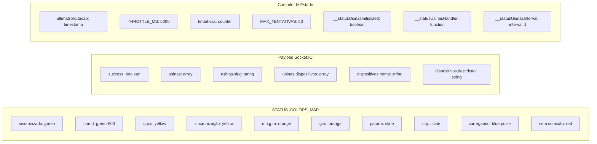
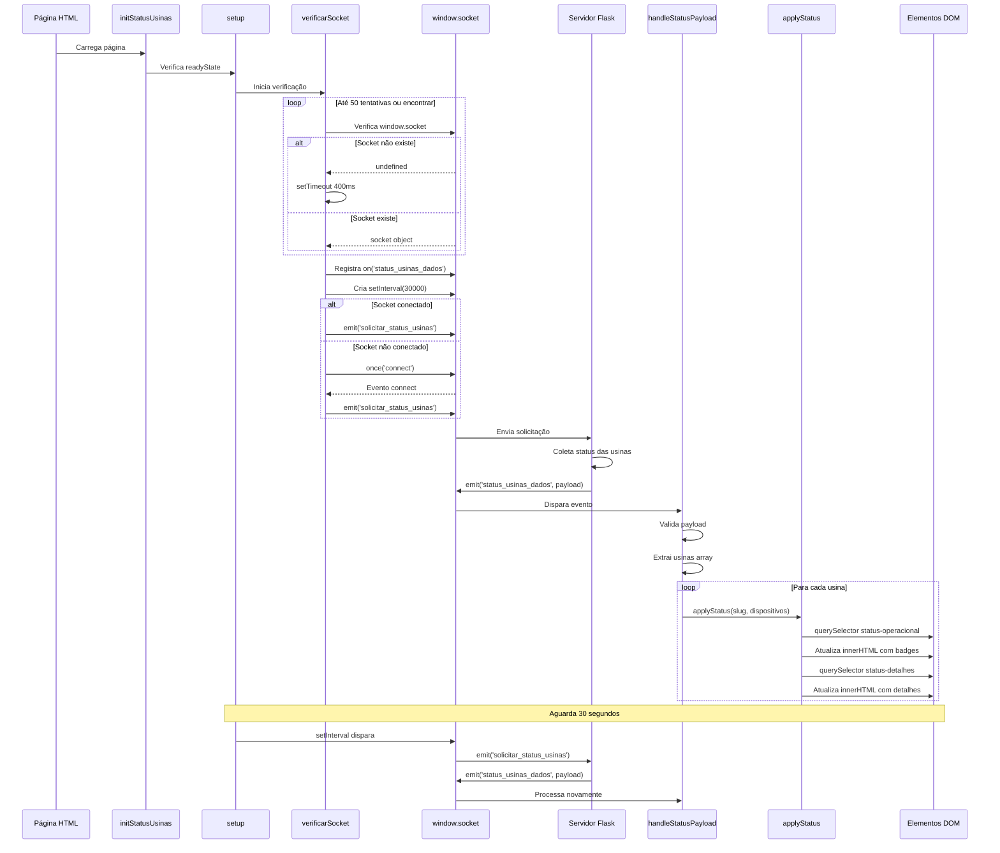

# Fluxograma - Status das Usinas (Socket.IO)

## Visão Geral do Fluxo de Execução

```mermaid
flowchart TD
    Start([Página Carregada]) --> CheckInit{window.__statusUsinasInitialized?}
    CheckInit -->|Sim| Abort([Aborta - Já Inicializado])
    CheckInit -->|Não| SetFlag[Define flag = true]
    SetFlag --> CallInit[Chama initStatusUsinas]
    
    CallInit --> CheckDOM{document.readyState === 'loading'?}
    CheckDOM -->|Sim| WaitDOM[Aguarda DOMContentLoaded]
    CheckDOM -->|Não| Setup
    WaitDOM --> Setup[Executa setup]
    
    Setup --> VerificarSocket[verificarSocket - Tentativa 1]
    
    VerificarSocket --> CheckSocket{window.socket existe?}
    CheckSocket -->|Não| IncTentativas[tentativas++]
    IncTentativas --> CheckMax{tentativas >= 50?}
    CheckMax -->|Sim| ErrorSocket([Erro: Socket não encontrado])
    CheckMax -->|Não| Retry[setTimeout 400ms]
    Retry --> VerificarSocket
    
    CheckSocket -->|Sim| LogFound[Log: Socket encontrado]
    LogFound --> CheckStatusDOM{Existe elemento status-operacional?}
    CheckStatusDOM -->|Não| WarnNoDOM([Aviso: Elementos não encontrados])
    CheckStatusDOM -->|Sim| CreateHandler[Cria handler para evento]
    
    CreateHandler --> CleanOldHandler{__statusUsinasHandler existe?}
    CleanOldHandler -->|Sim| RemoveOld[socket.off - Remove handler antigo]
    CleanOldHandler -->|Não| CheckOldInterval
    RemoveOld --> CheckOldInterval
    
    CheckOldInterval{__statusUsinasInterval existe?}
    CheckOldInterval -->|Sim| ClearOld[clearInterval - Limpa intervalo antigo]
    CheckOldInterval -->|Não| RegisterHandler
    ClearOld --> RegisterHandler
    
    RegisterHandler[socket.on 'status_usinas_dados']
    RegisterHandler --> CreateInterval[setInterval 30000ms]
    CreateInterval --> RegisterCleanup[Registra cleanup beforeunload]
    
    RegisterCleanup --> CheckConnected{socket.connected?}
    CheckConnected -->|Sim| SolicitarInicial[solicitar 'inicial']
    CheckConnected -->|Não| WaitConnect[socket.once 'connect']
    WaitConnect --> SolicitarInicial
    
    SolicitarInicial --> SolicitarStatus
    
    subgraph "Ciclo Automático (30s)"
        IntervalTrigger[⏰ setInterval dispara] --> SolicitarAuto[solicitar 'automatico']
        SolicitarAuto --> SolicitarStatus
    end
    
    SolicitarStatus[solicitarStatus] --> CheckThrottle{Última solicitação < 5s?}
    CheckThrottle -->|Sim| WarnThrottle([Aviso: Throttle ativo])
    CheckThrottle -->|Não| UpdateTime[Atualiza ultimaSolicitacao]
    UpdateTime --> EmitSocket[socket.emit 'solicitar_status_usinas']
    
    EmitSocket -.Backend processa.-> BackendResponse[Backend emite 'status_usinas_dados']
    
    BackendResponse --> HandlePayload[handleStatusPayload]
    HandlePayload --> CheckPayloadValid{payload válido && success?}
    CheckPayloadValid -->|Não| ErrorPayload([Erro: Payload inválido])
    CheckPayloadValid -->|Sim| GetUsinas[Extrai payload.usinas]
    
    GetUsinas --> LoopUsinas{Para cada usina}
    LoopUsinas --> CheckSlug{usina.slug existe?}
    CheckSlug -->|Não| WarnInvalid([Aviso: Item inválido])
    CheckSlug -->|Sim| CollectStatus[Coleta status dos dispositivos]
    CollectStatus --> ApplyStatus
    
    ApplyStatus[applyStatus slug, dispositivos] --> FindTarget{Encontra elemento DOM?}
    FindTarget -->|Não| WarnNoTarget([Aviso: Elemento não encontrado])
    FindTarget -->|Sim| RenderBadge[renderBadge dispositivos]
    
    RenderBadge --> CheckDevices{dispositivos.length > 0?}
    CheckDevices -->|Não| DefaultBadge[Retorna badge 'Status não disponível']
    CheckDevices -->|Sim| MapDevices[map - Para cada dispositivo]
    
    MapDevices --> GetColor[getColorByDescription]
    GetColor --> CheckDesc{descricao existe?}
    CheckDesc -->|Não| DefaultColor[Retorna cores 'parada']
    CheckDesc -->|Sim| MatchStatus{Verifica STATUS_COLORS_MAP}
    MatchStatus --> ReturnColors[Retorna cores correspondentes]
    ReturnColors --> BuildBadgeHTML[Constrói HTML do badge]
    BuildBadgeHTML --> UpdateDOM[Atualiza target.innerHTML]
    
    UpdateDOM --> CheckDetalhes{Existe elemento detalhes?}
    CheckDetalhes -->|Não| WarnNoDetalhes([Aviso: Detalhes não encontrado])
    CheckDetalhes -->|Sim| RenderDetalhes[renderStatusDetalhes]
    RenderDetalhes --> UpdateDetalhesDOM[Atualiza detalhes.innerHTML]
    
    UpdateDetalhesDOM --> NextUsina{Mais usinas?}
    NextUsina -->|Sim| LoopUsinas
    NextUsina -->|Não| LogComplete[Log: Atualização concluída]
    
    LogComplete --> WaitNextCycle[Aguarda próximo intervalo 30s]
    WaitNextCycle --> IntervalTrigger
    
    style Start fill:#e1f5e1
    style Abort fill:#ffe1e1
    style ErrorSocket fill:#ffe1e1
    style WarnNoDOM fill:#fff4e1
    style ErrorPayload fill:#ffe1e1
    style LogComplete fill:#e1f5e1
    style EmitSocket fill:#e1e5ff
    style BackendResponse fill:#e1e5ff
    style IntervalTrigger fill:#fff4e1
```

## Estrutura de Dados

## Funções Auxiliares - Renderização

```mermaid
flowchart TD
    subgraph "renderBadge"
        RB1[Recebe dispositivos array] --> RB2{Array vazio?}
        RB2 -->|Sim| RB3[Retorna badge padrão]
        RB2 -->|Não| RB4[map dispositivos]
        RB4 --> RB5[Para cada: nome, descricao]
        RB5 --> RB6[getColorByDescription]
        RB6 --> RB7[Constrói HTML com classes Tailwind]
        RB7 --> RB8[join - Concatena badges]
        RB8 --> RB9[Retorna HTML string]
    end
    
    subgraph "getColorByDescription"
        GC1[Recebe descricao string] --> GC2{descricao existe?}
        GC2 -->|Não| GC3[Retorna cores 'parada']
        GC2 -->|Sim| GC4[toLowerCase descricao]
        GC4 --> GC5[Loop STATUS_COLORS_MAP]
        GC5 --> GC6{descricao.includes key?}
        GC6 -->|Sim| GC7[Retorna colors objeto]
        GC6 -->|Não| GC8{Mais keys?}
        GC8 -->|Sim| GC5
        GC8 -->|Não| GC3
    end
    
    subgraph "renderStatusDetalhes"
        RD1[Recebe dispositivos array] --> RD2{Array vazio?}
        RD2 -->|Sim| RD3[Retorna mensagem padrão]
        RD2 -->|Não| RD4[map dispositivos]
        RD4 --> RD5[Extrai nome, descricao]
        RD5 --> RD6[Log informações]
        RD6 --> RD7[Constrói HTML detalhado]
        RD7 --> RD8[join - Concatena]
        RD8 --> RD9[Retorna HTML string]
    end
```

## Ciclo de Vida do Socket.IO

## Proteções e Controles

```mermaid
flowchart TD
    subgraph "Proteção contra Duplicação"
        PD1[Verifica __statusUsinasInitialized] --> PD2{Já existe?}
        PD2 -->|Sim| PD3[Aborta execução]
        PD2 -->|Não| PD4[Define flag e continua]
    end
    
    subgraph "Throttle de Solicitações"
        TS1[Recebe solicitação] --> TS2[Calcula tempo decorrido]
        TS2 --> TS3{< 5000ms?}
        TS3 -->|Sim| TS4[Bloqueia e avisa]
        TS3 -->|Não| TS5[Atualiza timestamp]
        TS5 --> TS6[Executa emit]
    end
    
    subgraph "Cleanup de Recursos"
        CR1[Evento beforeunload] --> CR2{__statusUsinasInterval existe?}
        CR2 -->|Sim| CR3[clearInterval]
        CR2 -->|Não| CR4[Nada a fazer]
        CR3 --> CR5[Define null]
    end
    
    subgraph "Limpeza de Handlers Antigos"
        LH1[Antes de registrar novo] --> LH2{__statusUsinasHandler existe?}
        LH2 -->|Sim| LH3[socket.off evento antigo]
        LH2 -->|Não| LH4[Continua]
        LH3 --> LH5{__statusUsinasInterval existe?}
        LH5 -->|Sim| LH6[clearInterval antigo]
        LH5 -->|Não| LH7[Continua]
        LH6 --> LH8[Registra novos handlers]
        LH4 --> LH8
        LH7 --> LH8
    end
```

## Legenda

- **🟢 Verde**: Pontos de início/sucesso
- **🔴 Vermelho**: Erros/abortos
- **🟡 Amarelo**: Avisos/ciclos
- **🔵 Azul**: Comunicação Socket.IO

## Métricas de Controle

| Variável | Valor | Descrição |
|----------|-------|-----------|
| `MAX_TENTATIVAS` | 50 | Tentativas máximas para encontrar socket (20s) |
| `POLL_MS` | 400 | Intervalo entre tentativas (ms) |
| `THROTTLE_MS` | 5000 | Tempo mínimo entre solicitações (ms) |
| `setInterval` | 30000 | Intervalo de atualização automática (ms) |
| `EVENTO` | 'status_usinas_dados' | Nome do evento Socket.IO |
